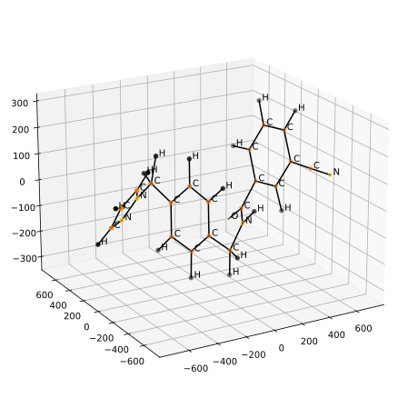

# Approximating the energy of molecules from their three-dimensional representations using neural networks

## Abstract

In this project we tried to predict the potential energy of organic molecules using feed forward neural networks. The traditional methods of computing the energy are computationally expensive and the cost increases with the number of atoms in the molecules. Neural networks are great function approximators that compute comparatively quickly, which makes using them a promising approach. The input data used are the molecule confirmations, position of the atoms in 3D space. By rephrasing the problem as a constraint satisfaction problem, we reduced confirmations to the number of bond pairs. We did hyperparameter tuning to find the right model architecture and parameters. Then, we trained a multilayer perceptron to solve the regression problem of finding the energy of a molecule. Lastly, we reported that the model has a mean absolute error of ±1 for big molecules and discussed potential improvements.

## Authors
- [Mansur Nurmukhambetov](https://github.com/nomomon)
- [Thomas Rey](https://github.com/thomasrey01)
- [Julius Wagenbach](https://github.com/jwagenbach)
- Matthijs Jongbloed

## Links 
- [Report](https://nomomon.github.io/molecule-energy-prediction/report/report.pdf)

  

